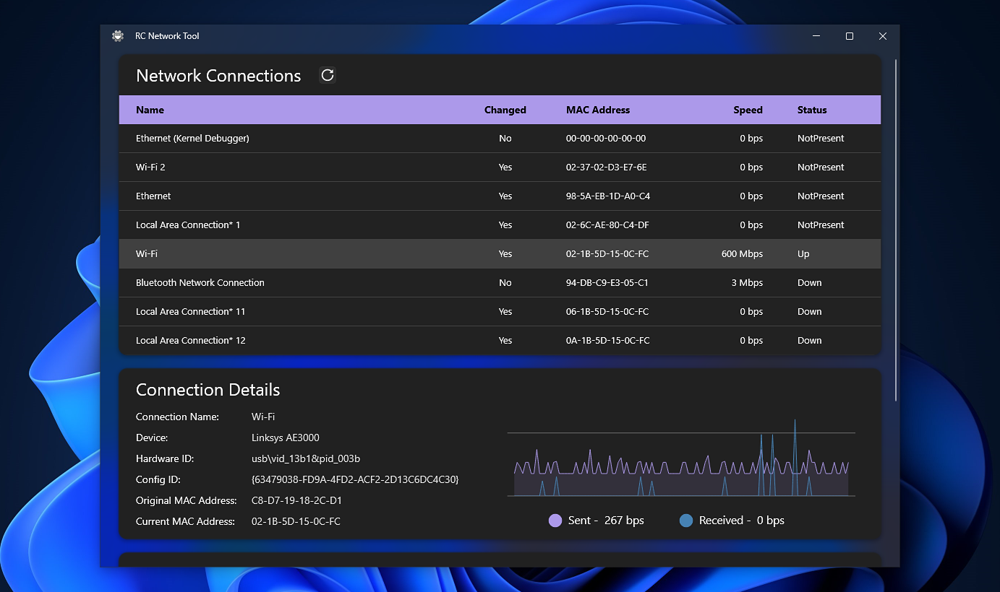
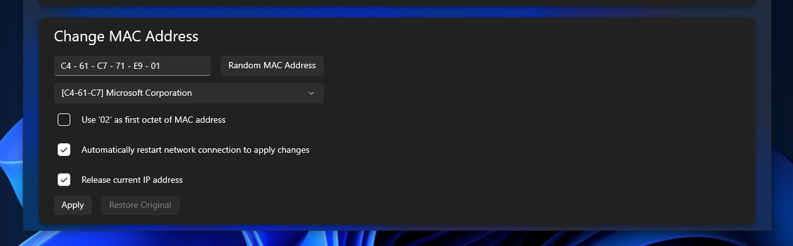

# RC Network Tool

## What is it?

RC Network tool is a .NET MAUI-based network utility designed to manage and change MAC addresses for network adapters on Windows machines.

Main features include:

- Network Adapter Info: Lists all available network adapters, displaying details such as name description, hardware ID, current MAC address, original MAC address, speed, and operational status.
- MAC Address Modification: Allows users to generate random MAC addresses or select a vendor-specific MAC OUI (Organizationally Unique Identifier) from a registry. Users can manually enter a MAC address, and the app validates the input for correct format and hexadecimal characters.
- Apply & Restore MAC Address: Users can apply a new MAC address to the selected adapter. The application updates the Windows registry and can optionally restart the network adapter and release its IP address to ensure changes take effect. Users can also restore the original MAC address.
- Live Network Statistics: Displays real-time upload and download speeds for the selected adapter using charts.

    

## How do I use it?

1. Select the network adapter whose MAC address you would like to modify.
2. Select a MAC OUI vendor from the drop-down or click the 'Random MAC Address' button. 
*If you are modifying a Wi-Fi / Wireless adapter, ensure that the 'Use '02' as first octect of MAC Address' checkbox is checked.*
3. Decide whether or not you want to restart the network connection to fully apply the changes you made, and whether or not you want to release the network adapter's current IP address before changes are made.
4. Press 'Apply'!
5. If you would like to revert your network adapter to it's original MAC address settings, you can press 'Restore Original'.

    

